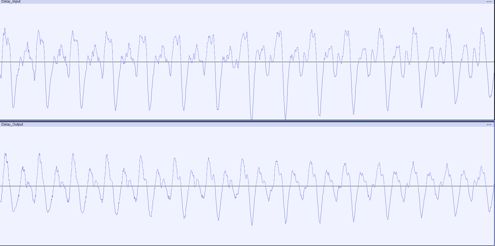
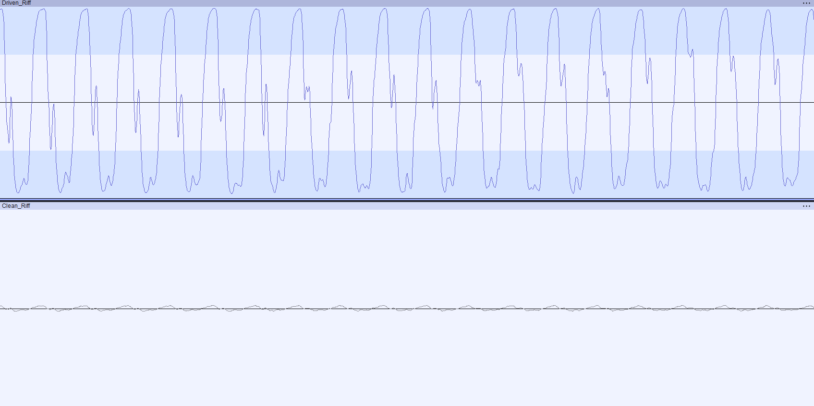
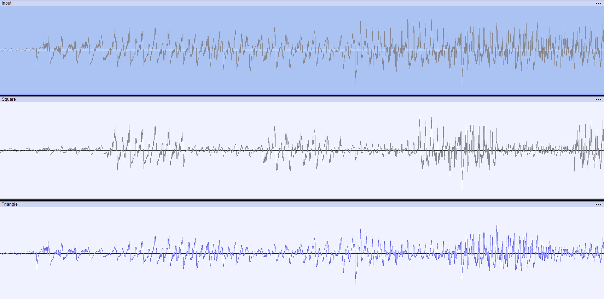

**This repository is a work in progress.**  
Please be patient as I continue to develop and update this project!
I apologize for this being incomplete, everything will be updated and properly structured as the project evolves.

I have uploaded some `.cpp` files which were used to test the effects with .wav files as well as the real-time code that I am currently wokring on.  
There are `.mp4` files located in the "Audio Demos" folder which are audio examples demonstrating the effects. The volume is very inconsistent between the files, so test the volume prior to listening. Also, headphones are recommended.

**Thank you for visiting this repository!**

---

## Table of Contents
- [Introduction](#introduction)
- [Effects](#effects)
- [Audio Demos](#audio-demos)
- [Waveform Analysis](#waveform-analysis)
- [Sources](#sources)

---

## Introduction

Currently, I am engineering a professional-grade multi-effects pedal utilizing the Raspberry Pi platform and embedded C++. The project features various real-time DSP algorithms, modular effects architecture, and a low-latency audio pipeline within an embedded Linux environment, utilizing JACK and ALSA for advanced audio routing and I/O management. Key technical highlights include ARM-based optimization, high-quality hardware integration (ADC/DAC), efficient C++ DSP implementation, performance optimization, and waveform analysis to ensure signal integrity and reliability. This project is continually expanding my skills in embedded systems, DSP, and electrical/computer engineering; furthering both my professional development and fueling my creative expression as a musician.

---

## Effects

_This list of the effects will grow as the project develops._

Currently, the repository includes 3 digital audio effects based on real analog pedals:

- **Delay (MXR Carbon Copy)**
  - [.wav Version](Effects/DigitalDelay.cpp)
    
- **Overdrive (Ibanez TubeScreamer 808)**
  - [.wav Version](Effects/Overdrive.cpp)

- **Tremolo (Boss TR2)**
  - [.wav Version](Effects/Tremolo.cpp)

- **Real-Time Effects**
  - [Current Version](Real_Time_Code/effects.cpp)
---

## Audio Demos

The `Audio Demos` folder contains example outputs for each effect:

- [Delay Input](Audio_Demos/Delay_Intput.mp3)
- [Delay Output](Audio_Demos/Delay_Output.mp3)
  
-  [Overdrive Output](Audio_Demos/Overdrive_Output.mp3)
-  [Overdrive Intput](Audio_Demos/Overdrive_Input.mp3)

-  [Tremolo Input](Audio_Demos/Overdrive_Input.mp3)
-  [Squared Tremolo Output](Audio_Demos/Overdrive_Square_Ouput.mp3)
-  [Triangular Tremolo Input](Audio_Demos/Overdrive_Triangle_Output.mp3)

---

## Waveform Analysis

**Delay**

The top waveform shows the dry input, while the bottom waveform illustrates the output mixed with echoes from the delayed portion of the signal. It is kind of hard to see this within a waveform but when the delayed signal is added to the current signal it causes slight noise cancelation hence the decrease in amplitude. This effect uses an impulse response algorithm to add the previous notes to to signal. To mimic an analog delay there is a LPF filter applied to the delayed signal. Excluding the first iteration, the delayed signal is kept "alive" with the regen variable, this causes the specific delay to stay in the signal and fade away. The dry and delayed signal and then summed together to have the input overlapped with the delay.

**Overdrive**

The top waveform is the driven output, and the bottom is the clean intput. The overdrive alters the waveform’s shape, adding harmonics and increasing amplitude. This effect puts the signal through a gain-stage and then
applies a non-linear clipping using the hyperbolic tangent function. (tanh) This clipping mimics tube amp drive circuits which creates odd harmonics. (3rd, 5th 7th) These odd harmonics correspond to a dominant 7th chord,
(I, III, V, _b_VII, which in music theory relate to a blues sounding tone warm (low-mid frequencies 200-500hz) tone. Lastly the signal is ran through a LPF which is controlled by the tone knob, which determines the alpha factor. 

**Tremolo**

The top signal is the input (dry), and the bottom signals show the output modulated by square and triangle LFO's. Tremolo works by periodically amplifies and then attenuates only the amplitude of a signal periodically. This is the first and most basic modulation effect. Modulation effects used LFOs which cannot be heard to change a specific variable. In this case we are changing the volume to have a fading in-and-out sound, but when the speed is increased the sound becomes "wobbly" and unstable. There are 2 main shapes of this LFO, square and triangular. Square instantaneously changes the volume making the signal very choppy. Triangular linearly changes the volume, making a more smooth sound. In my effect there is a shape control to mesh the square and triangle LFO to combine the sounds of both.

## Sources

_Relevant sources, references, and inspirations will be listed here:_

- [Tube Screamer Analysis - Electrosmash](https://www.electrosmash.com/tube-screamer-analysis)
- [The Tremolo Project - Blogspot](https://tremolo-project.blogspot.com/2017/08/boss-tr-2.html)
- [Dynamic-Range-Compression](https://en.wikipedia.org/wiki/Dynamic_range_compression)

---

Stay Tuned for more updates!
